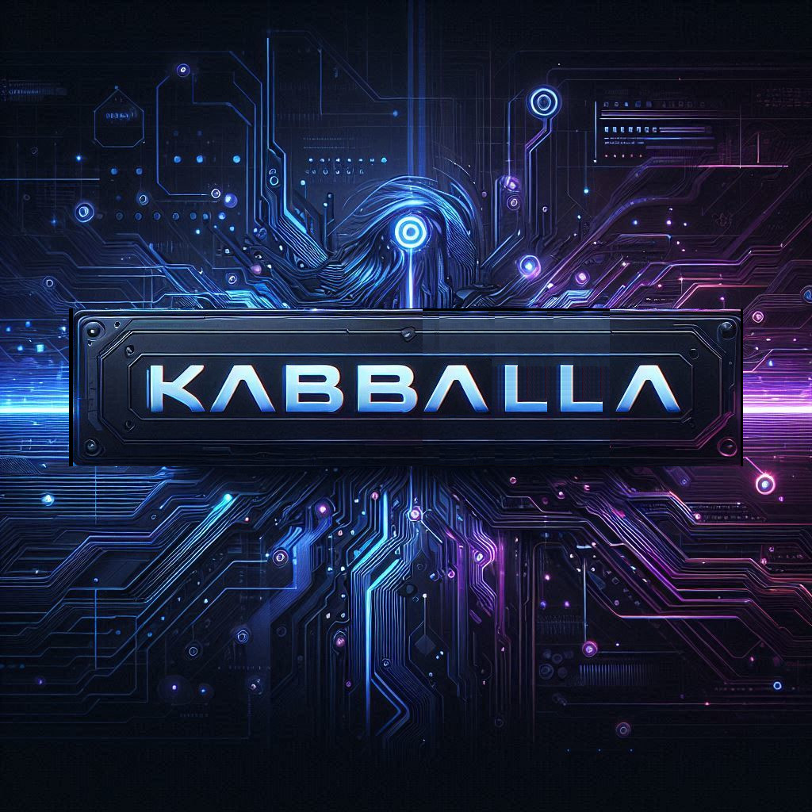

    

    

    

> If you enjoy the project, please consider giving us a GitHub star ⭐️. Thank you!

## Sponsors

If you want to support our project and help us grow it, you can [become a sponsor on GitHub](https://github.com/sponsors/coozila)

  

# Introducing Kabballa: Compose APP for UNA Applications Deployment

This application is designed to launch online UNA APPS alongside UNA Messenger, Jitsy Met, Jot server, and other related services.

This application is part of a larger platform called **Kabballa**. Kabballa is a cutting-edge application designed to streamline the management and deployment of modern, scalable infrastructures. This platform supports a wide array of technologies, including MySQL, Redis, Nginx, PHP, Golang, Vite, Node.js, Memcached, Elasticsearch, and more. Leveraging the power of Kubernetes (K8s) or Docker Swarm, it provides an efficient way to host and orchestrate applications across multiple environments. Soon, Kabballa will become open source, inviting the community to contribute and innovate.

**Final Goal:** The ultimate aim is to launch UNA Apps in a global multicloud environment, ensuring redundancy and scalability using Karmada and Kubernetes.

## Features

- **Reverse Proxy Routing:** Forwards requests to a specified backend server.
- **TLS Encryption:** Secures connections using custom TLS certificates.
- **Automatic HTTPS Redirection:** Redirects HTTP traffic to HTTPS.
- **CORS Support:** Handles both preflight and actual CORS requests.
- **Caching & Compression:** Supports caching mechanisms and uses gzip and Zstandard for compression.
- **Security Headers:** Implements various security policies to safeguard against common web vulnerabilities.
- **UNA Ecosystem Integration:** Aims to launch and support UNA APPS, UNA Messenger, Jitsy Met, Jot server, and other services for a complete online deployment solution.
- **Part of Kabballa Platform:** Integrates into the Kabballa platform which streamlines modern infrastructure management and deployment.
- **Global Multicloud Deployment:** Designed to launch UNA Apps globally, ensuring redundancy and scalability through Karmada and Kubernetes.
